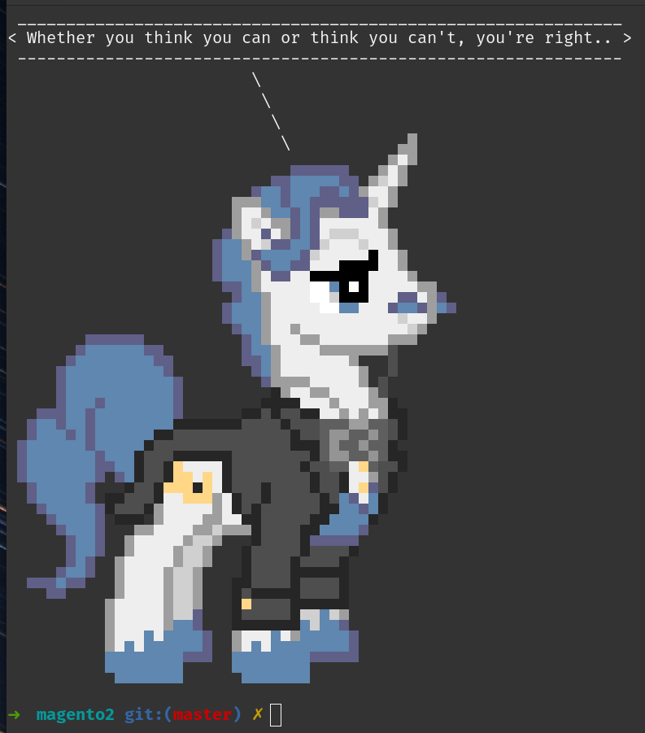

# Quote of the Day <3 Ponysay
Load the quote of the day and run it throught Ponysay.



## Prerequisities
I think nowadays most of you will have all or one of the next available.

- [podman](https://podman.io/) or [docker](https://www.docker.com/)
- [Quotes.rest](https://quotes.rest/) API key (free)
- [jq](https://jqlang.github.io/jq/)

## Installation
To install this awesome combination, download the [qotd](qotd) file and place it somewhere you can access it.

## Running
You need to create a API key for quotes.rest to access the api of They Said So.
Create a account and API code here https://theysaidso.com/user/subscriptions

```bash
export QOTD_API_KEY="[YOURAPIKEYHERE]"
qotd
# ----
or combine
QOTD_API_KEY="[YOURAPIKEYHERE]" qotd
```

## Caching
I write the quote to `~/.config/qod.json` so I don't bash the API all day.

## Special thanks
Thanks quotes.rest and Ponysay for making this possible <3

- https://github.com/erkin/ponysay
- https://quotes.rest

Author:
- [Jeroen Boersma](https://github.com/jeroenboersma)
